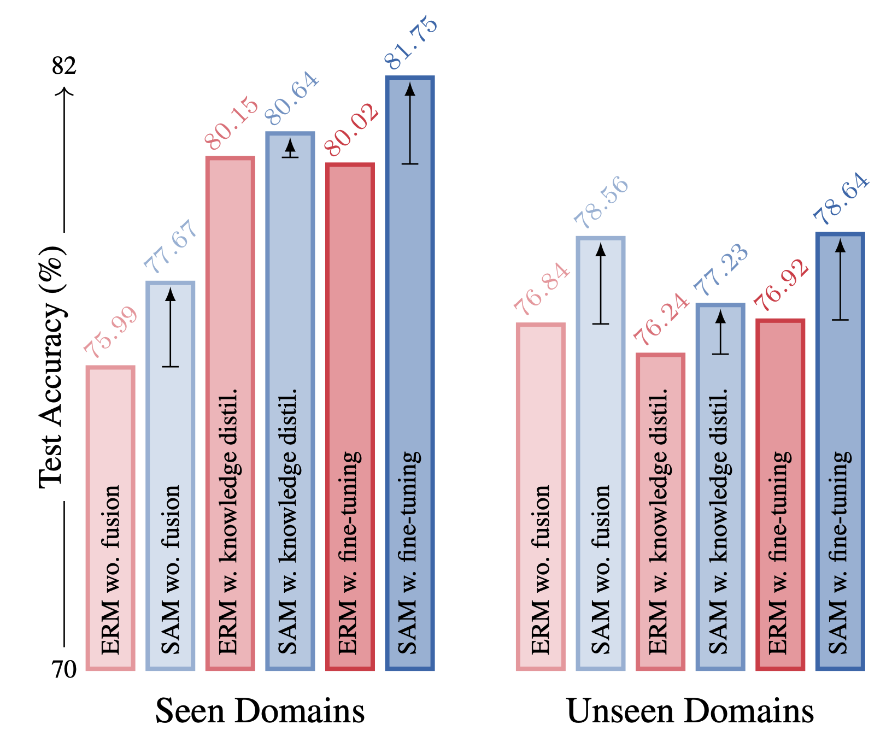

# Flatness Improves Backbone Generalisation in Few-shot Classification

Implementation for the following paper:
Rui Li, Martin Trapp, Marcus Klasson, and Arno Solin (2025). **[Flatness Improves Backbone Generalisation in Few-shot Classification](https://arxiv.org/pdf/2404.07696)**. In *Winter Conference on Applications of Computer Vision (WACV)*

We introduce a simple yet effective training protocol for the backbone in few-shot classification. We show that flatness-aware backbone training combined with vanilla fine-tuning results in a simpler yet competitive baseline compared to the state-of-the-art. We present theoretical and empirical results indicating that careful backbone training is crucial in FSC.

*Average test accuracy on the Meta-Dataset benchmark for different backbone training under the same adaptation: empirical risk minimisation (ERM) without information fusion, with fine-tuning, or with knowledge distillation; sharpness-aware minimisation (SAM) without information fusion or with fine-tuning.*

## Dependencies
This code requires the following:
* PyTorch 1.13.1
* TensorFlow 2.8.1

## Usage
- Clone or download this repository.
- Setup [Meta-Dataset](https://github.com/google-research/meta-dataset):
    * Follow the the "User instructions" in the Meta-Dataset repository for "Installation" and "Downloading and converting datasets". 
- After setting up Meta-Dataset, backbone can be trained with SAM using `train_vanilla_sam.py`
    * Change line 54 to load `MetaDatasetEpisodeReader, MetaDatasetBatchReader`.
- To select backbone for evaluation, run `select_backbone.py`.
    * Save the trained backbones in `saved_model/sam/{dataset}.pth` or change line 22.
    * Change line 12 to load `MetaDatasetEpisodeReader`.

## Acknowledge

We thank authors of [Meta-Dataset](https://github.com/google-research/meta-dataset), [PARC](https://github.com/dbolya/parc), [SAM](https://github.com/davda54/sam) and [SUR](https://github.com/dvornikita/SUR) for their source code.